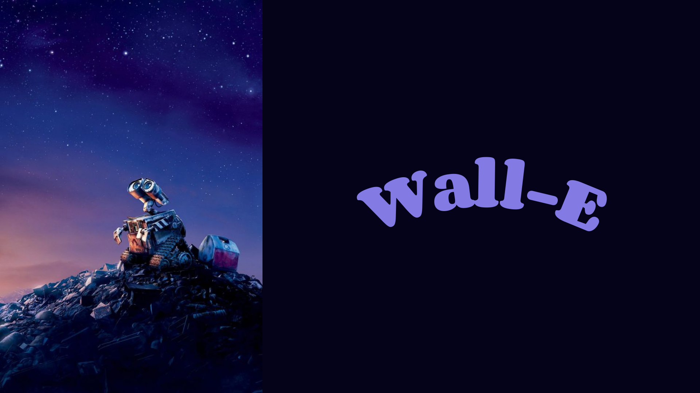
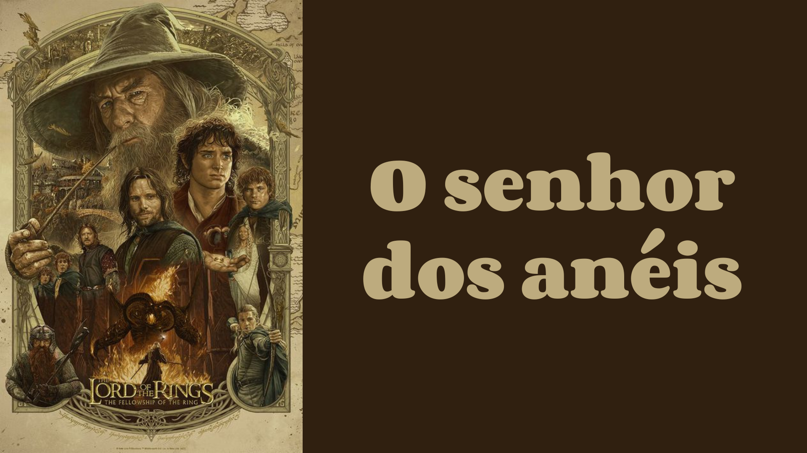
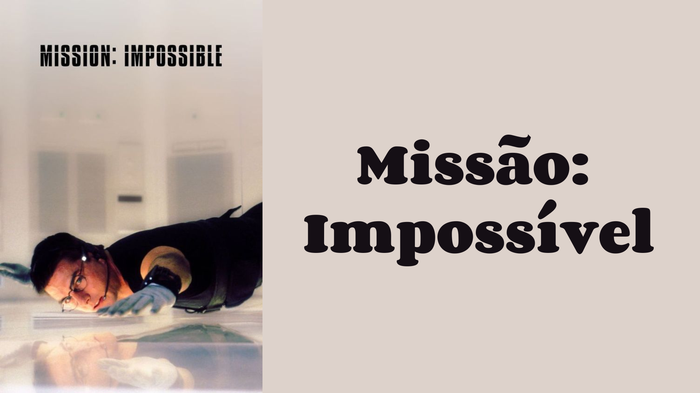
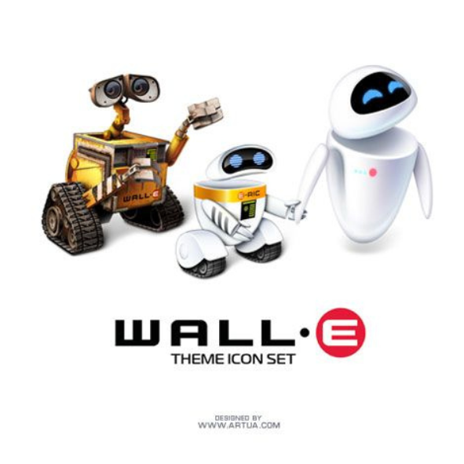
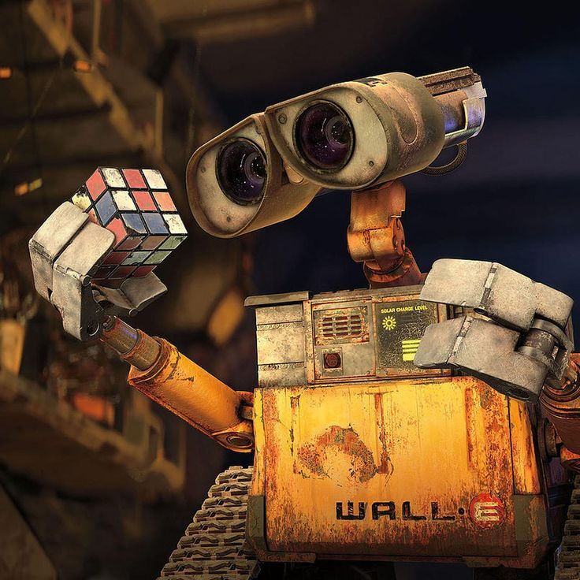
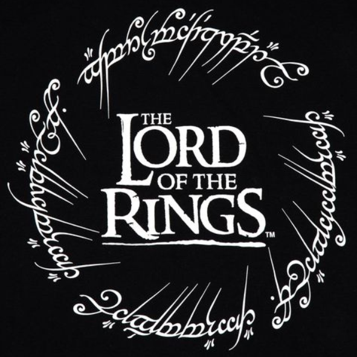
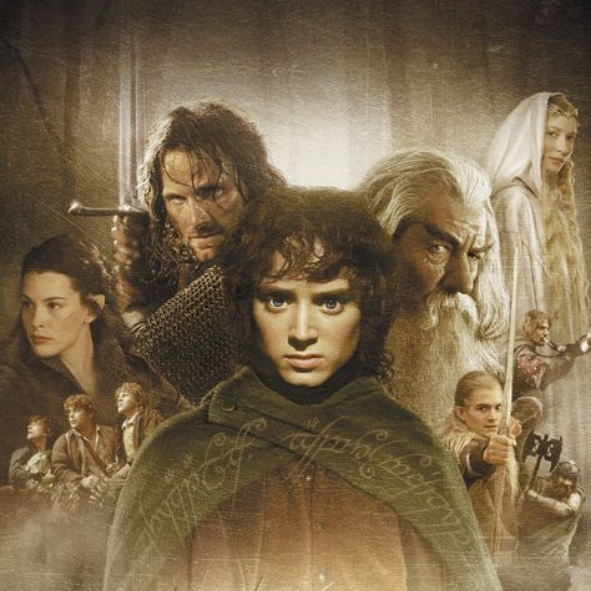
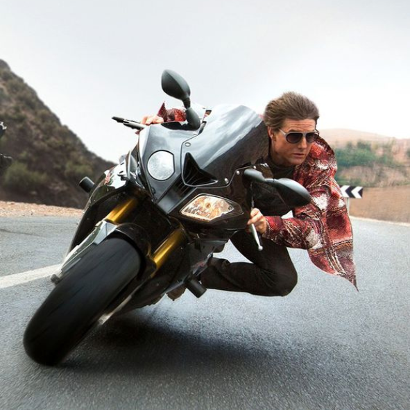

<!DOCTYPE html>
<html lang="en">
<head>
    <meta charset="UTF-8">
    <meta name="viewport" content="width=device-width, initial-scale=1.0">
    <title>Filmes</title>
    <link rel="icon" href="img/icon.png">
</head>
<body>

<!--NavBar-->
    <nav class="navbar col-12 position-fixed bg-dark navbar-expand-lg" data-bs-theme="dark" style="z-index: 999;">
      

        <a class="navbar-brand" href="#">Navbar</a>
        <button class="navbar-toggler" type="button" data-bs-toggle="collapse" data-bs-target="#navbarNav" aria-controls="navbarNav" aria-expanded="false" aria-label="Toggle navigation">
          
        </button>
        

          <ul class="navbar-nav">
            <li class="nav-item">
              <a class="nav-link active" aria-current="page" href="#filmes">Filmes</a>
            </li>
            <li class="nav-item">
              <a class="nav-link" href="#conteudo">Conteúdo</a>
            </li>
            <li class="nav-item">
              <a class="nav-link" href="#footer">Direitos</a>
            </li>
          </ul>
        

      

    </nav>

<!-- Carousel -->
      

        

          

            
          

          

            
          

          

            
          

        

        <button class="carousel-control-prev" type="button" data-bs-target="#carouselExampleAutoplaying" data-bs-slide="prev">
          
          Previous
        </button>
        <button class="carousel-control-next" type="button" data-bs-target="#carouselExampleAutoplaying" data-bs-slide="next">
          
          Next
        </button>
      

        
<!-- Cards -->
<!-- Card 1 -->
      <h2 id="filmes" class="text-center">Filmes</h2>
      

        

          

            
            

              <h5 class="card-title">Wall-E</h5>
              
"Wall-E" é um filme de 2008, dirigido por "Andrew Staton" e indicado ao Oscar de melhor animação.

<!-- Button trigger modal -->
              <button type="button" class="btn btn-primary" data-bs-toggle="modal" data-bs-target="#exampleModal">
                Clique para saber mais...
              </button>
<!-- Modal -->
              

                

                  

                    

                      <h1 class="modal-title fs-5" id="exampleModalLabel">Sinopse:</h1>
                      <button type="button" class="btn-close" data-bs-dismiss="modal" aria-label="Close"></button>
                    

                    

                      
                        
                      Após entulhar a Terra de lixo e poluir a atmosfera com gases tóxicos, a humanidade deixou o planeta e passou a viver em uma gigantesca nave. O plano era que o retiro durasse alguns poucos anos, com robôs sendo deixados para limpar o planeta. WALL-E é o último destes robôs, e sua vida consiste em compactar o lixo existente no planeta. Até que um dia surge repentinamente uma nave, que traz um novo e moderno robô: Eva. A princípio curioso, WALL-E se apaixona e resolve segui-la por toda a galáxia.
                    

                    

                      <button type="button" class="btn btn-secondary" data-bs-dismiss="modal">Fechar</button>
                    

                  

                

              

            

          

        

<!-- Card 2 -->
        

          

            
            

              <h5 class="card-title">O Senhor dos Anéis: A Sociedade do Anel</h5>
              
Lançado em 2002, este filme é um sucesso até os dias de hoje.

              <!-- Button trigger modal -->
                <button type="button" class="btn btn-primary" data-bs-toggle="modal" data-bs-target="#exampleModall">
                  Clique para saber mais...
                </button>

                <!-- Modal -->
                

                  

                    

                      

                        <h1 class="modal-title fs-5" id="exampleModalLabel">Sinopse:</h1>
                        <button type="button" class="btn-close" data-bs-dismiss="modal" aria-label="Close"></button>
                      

                      

                        
                        Em uma terra fantástica e única, um hobbit recebe de presente de seu tio um anel mágico e maligno que precisa ser destruído antes que caia nas mãos do mal. Para isso, o hobbit Frodo tem um caminho árduo pela frente, onde encontra perigo, medo e seres bizarros. Ao seu lado para o cumprimento desta jornada, ele aos poucos pode contar com outros hobbits, um elfo, um anão, dois humanos e um mago, totalizando nove seres que formam a Sociedade do Anel.
                      

                      

                        <button type="button" class="btn btn-secondary" data-bs-dismiss="modal">Close</button>
                        <button type="button" class="btn btn-primary">Save changes</button>
                      

                    

                  

                

                            

                          

                        

        

<!-- Card 3 -->
        

          

            
            

              <h5 class="card-title">Missão Impossível</h5>
              
Lançado em 1996, este filme é o primeiro de uma saga que se mostra rentável até os dias atuais.

              <!-- Button trigger modal -->
                  <button type="button" class="btn btn-primary" data-bs-toggle="modal" data-bs-target="#exampleModa">
                    Clique para saber mais...
                  </button>
                  <!-- Modal -->
                  

                    

                      

                        

                          <h1 id="modal1" class="modal-title fs-5" id="exampleModalLabel">Sinopse:</h1>
                          <button type="button" class="btn-close" data-bs-dismiss="modal" aria-label="Close"></button>
                        

                        

                          
                            
                          O agente do governo Ethan Hunt e seu mentor, Jim Phelps, embarcam em uma missão secreta que toma um rumo desastroso: Jim é morto e Ethan torna-se o principal suspeito do assassinato. Em fuga, Hunt recruta o brilhante Luther Stickell e o piloto Franz Krieger para ajudá-lo a entrar no prédio da CIA, fortemente vigiado, a fim de pegar um arquivo de computador confidencial que pode provar a sua inocência.
                        

                        

                          <button type="button" class="btn btn-secondary" data-bs-dismiss="modal">Close</button>
                          <button type="button" class="btn btn-primary">Save changes</button>
                        

                      

                    

                  

            

          

        

      

      <!-- Conteudo -->
        
      

       
      

        <h2 id="conteudo" class="text-center">Meus filmes favoritos:</h2>
        
Vejam um pouco dos meus filmes favoritos, esses são longas-metragem que me marcaram bastante.
        

      

      

        

      <!-- Rodapé -->
      <footer id="footer" class="page-footer p-5 m-auto"
        style="background-color: #333;">
        

          <a href="#">@2023 Copyright: João Henrique de Oliveira Ribeiro</a>
        

      </footer>

      <link href="https://cdn.jsdelivr.net/npm/bootstrap@5.3.1/dist/css/bootstrap.min.css" rel="stylesheet" integrity="sha384-4bw+/aepP/YC94hEpVNVgiZdgIC5+VKNBQNGCHeKRQN+PtmoHDEXuppvnDJzQIu9" crossorigin="anonymous">
      
</body>
</html>
